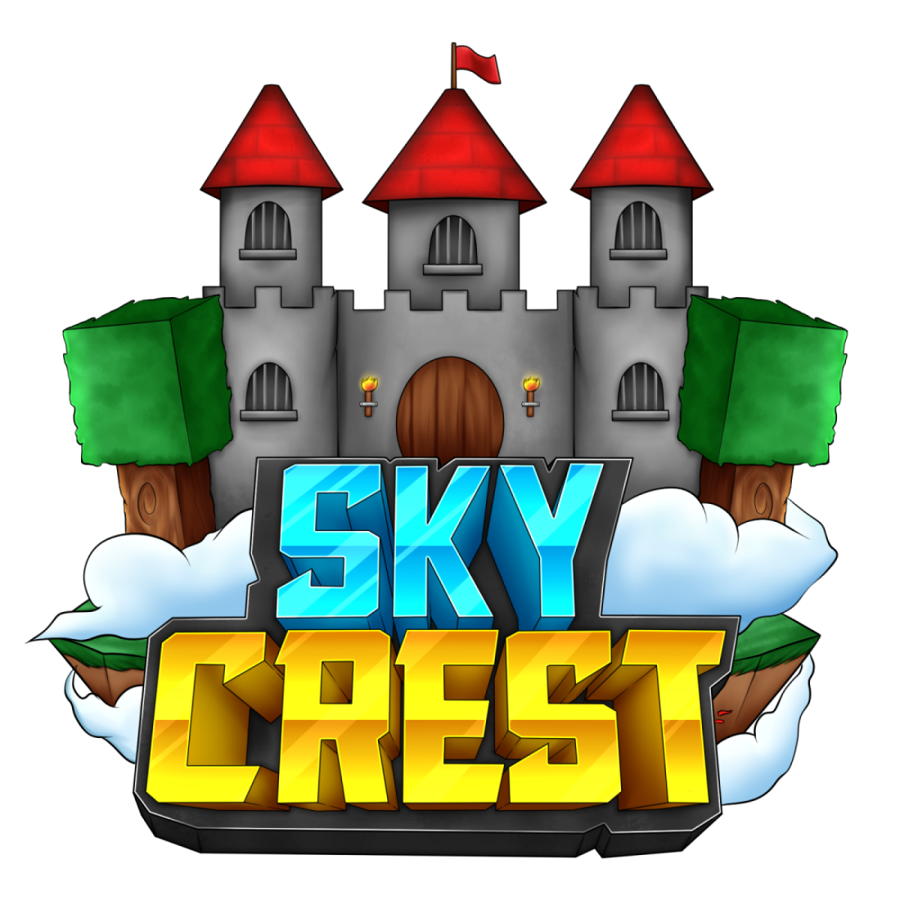

  

# SkyCrest Resource Pack 

A Minecraft BE Texture pack designed for the SkyCrest Minecraft server.

This pack has been made open sourced due to server closure. If code is used or the pack is modified, please leave credit where due and abide by the package license.

Last tested on MC version: 1.18.x
